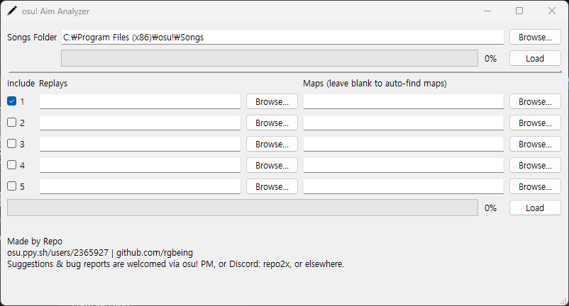
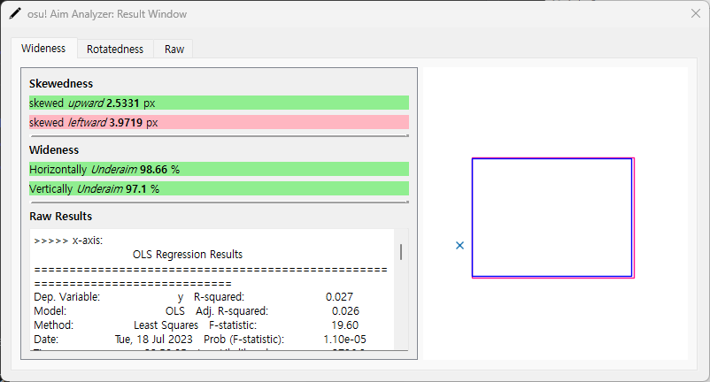
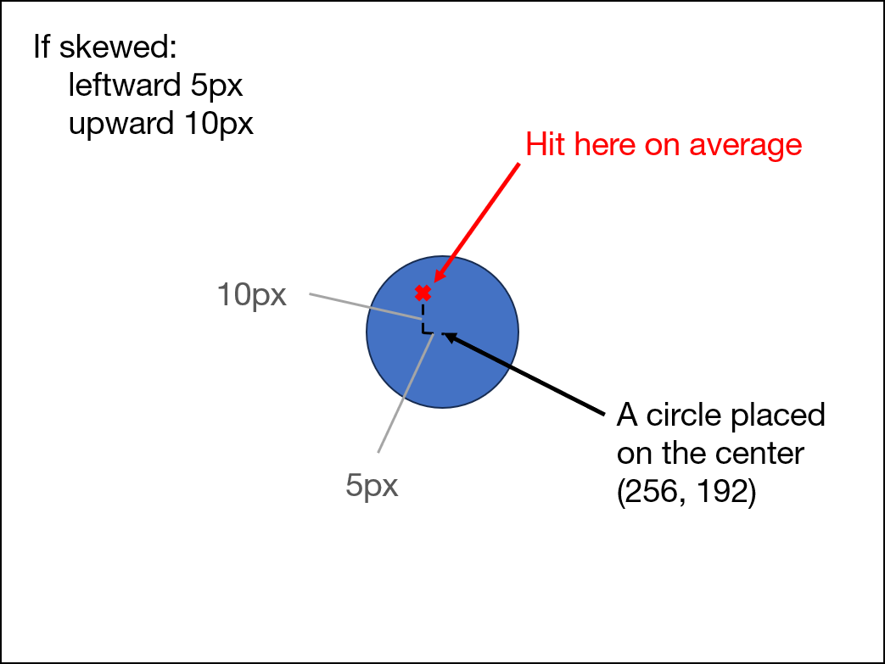
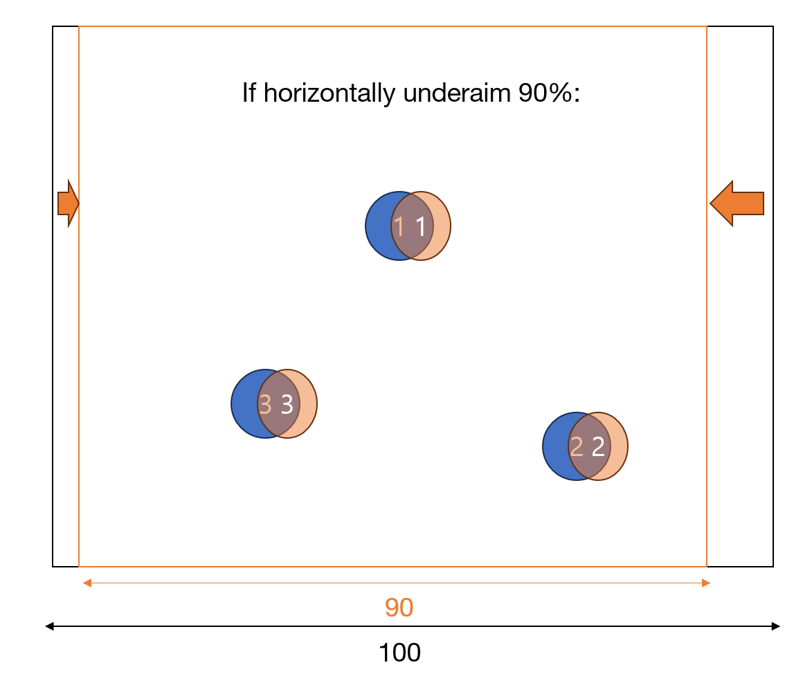
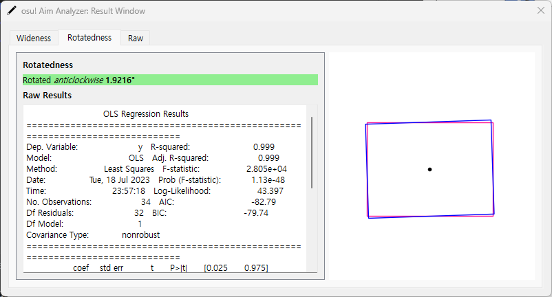
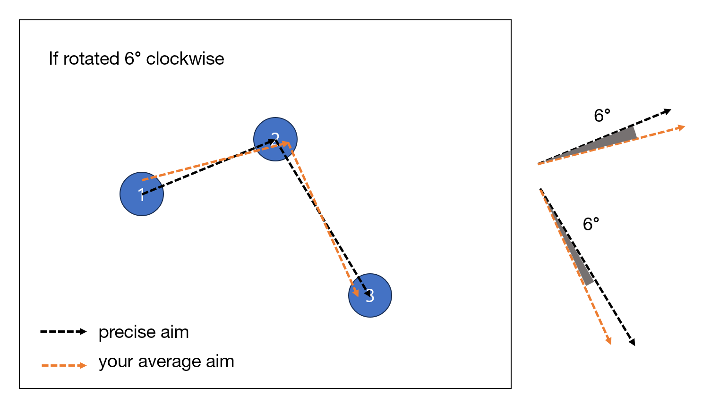
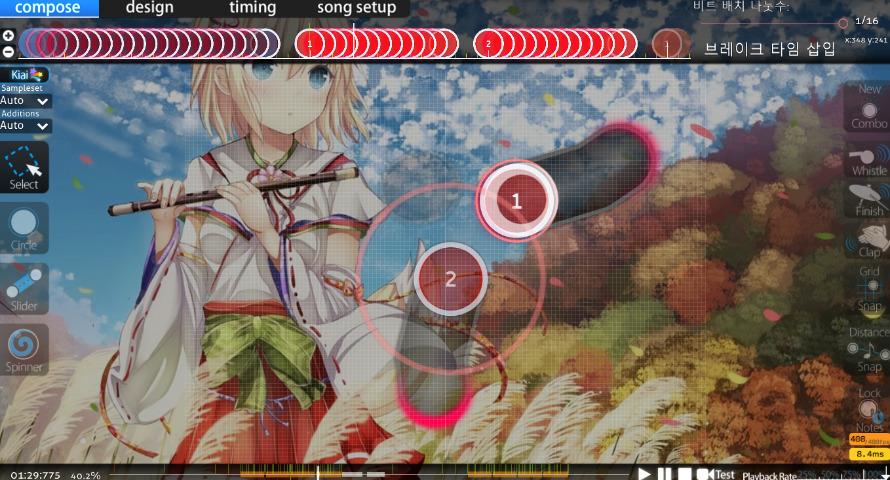
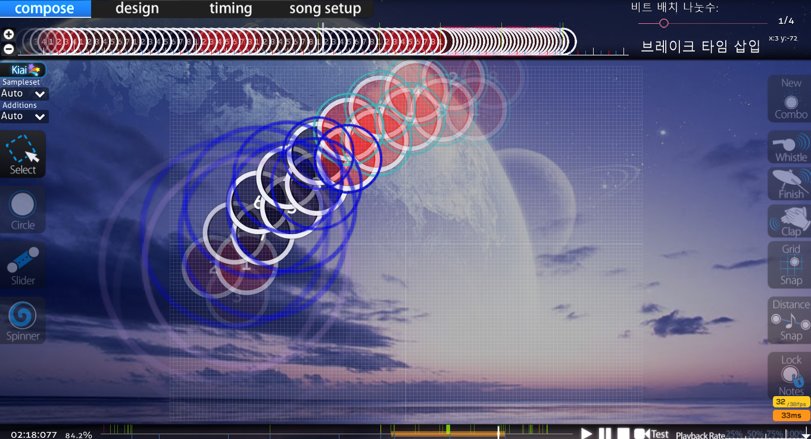

# Osu! Aim Analyzer

This is a program to inspect a replay and diagnose player's aim.

## Appreciation
This program includes the whole source file of [Awlexus](https://github.com/Awlexus)'s [python-osu-parser](https://github.com/Awlexus/python-osu-parser), located on *osuparse* folder under *core* folder.

## Download
Check the *Release* page!

*AimAnalyzer.zip* file will be there. Download and unzip it, and open *AimAnalyzer.exe* inside it.

## How To Use
If you open the AimAnalyzer.exe, you will look this window:

Quite straightforward, input a replay file(.osr) you want to inspect by the *Browse...* button on Replays tab, and input the corresponding map file on Maps tab. Then click the *Load* button on the right side.

Unfortunately, slot #2~#5 is not implemented yet, so they are not available currently. You can inspect one replay per a run now.

When the replay is loaded, the program will show you the following window.


Basically, **green** background means that this result is significant statistically. Conversely, **red** background means that this result is statistically unsignificant, so you may want to ignore that line of the result.

### Raw tab
Raw tab shows if the replay is parsed well. Before you check the results, it is **recommended to check this tab first** to see if the replay is parsed well.

The contents of this tab is written on the following format:
```
Time [timing] - Object: ([x], [y]) Pressed: ([p_x], [p_y]) @ [clicked_time]
```
* *timing*: the timing of the object
* *x*, *y*: the x and y coordinates of the object
* *p_x*, *p_y*: the x and y coordinates of where the player clicked the object
* *clicked_time*: the timing the player clicked the object

If the object is not pressed, or at least not attepted to be pressed, then *Not Pressed* must be written on the *Pressed* part. So you can **check if the replay is parsed well** by checking **if there are too many *Not Pressed* phrases exist**.

### Wideness tab

On *Wideness* tab, there are two parts of the result, *Skewedness* and *Wideness*.

Skewedness part shows you **How much your aim is skewed**. To say more specifically, it shows you that **for the circle placed at the center of the playfield**(i.e., (256, 192))**, where you hit that circle.** The cartoon shown below might help you understand it.


Wideness part shows you **How much you overaim/underaim** on average. In other words, it shows **How much your tablet range** (or just aim range for mouse palyers) **is wide or narrow** on average.


Raw Result part just shows the raw result of *statsmodels* fitting a linear regression model.

There is a graph on the leftside showing these results visually. The **pink** rectangle shows the original playfield, and the **blue** rectangle shows your average playfield compared to the original playfield. The **x-shaped marker** on the graph means that you are expected to hit objects on this location perfectly (i.e., errors are expected to be zero) on average. If the place for marker is located far away from the playfield, then it might not be shown.


### Rotatedness tab


Rotatedness tab shows you **how much your aim is rotated** on average.



Similar to the *Wideness* tab, the **pink** rectangle shows the original playfield, and the **blue** rectangle shows your average playfield compared to the original playfield. The black dot is the center of the playfield.

## (Possible) Application for Diagnosis of Players' Tablet Range
0. Check *Raw* tab first, to see if the parsing process is done successfully.

1. It is recommended to offset *skewedness* first. However, in my experience, skewedness does not affect your aim accuracy very much, so you may ignore the *Skewedness* part unless you feels uncomfortable for the current range? (This is no more than my experience indeed)
* If the result have red color, then you can just ignore that as that is an unsignificant result.
* If the tool says it is skewed *leftward*, then move your tablet range *leftward*. In OpenTabletDriver, this will decrease the x-coordinate of the tablet range. Vice versa for the *rightward* case.
* If the tool says it is skewed *upward*, then move your tablet range *upward*. In OpenTabletDriver, this will decrease the y-coordinate of the tablet range. Vice versa for the *downward* case.

2. To offset *wideness*, it is quiet straightforward:
* Of course, if the result have red color, then you can just ignore that as that is an unsignificant result.
* If you horizontally overaim, decrease the width. Vice versa for the underaim case.
* If you vertically overaim, decrease the height. Vice versa for the underaim case.
* You may want to keep the width-height ratio same to the playfield. Then do so (actually I do so).

3. To offset *rotatedness*:
* If it says it is rotated *clockwise*, then rotate your tablet area *clockwise*. In OpenTabletDriver, this will increase your rotation value.
* If it says it is rotated *anticlockwise*, then rotate your tablet area *anticlockwise*. In OpenTabletDriver, this will decrease your rotation value.

## Bits of not important theoretical background

### What osu! objects is this program inspect?
This program inspect only **circles which have enough distance with the previous object**. This is because:
* Inspecting spinners to check one's aim has no point!
* Regarding sliders, there are cases that player *intentionally* click the non-center place of an object. For example:
    * hitting those super fast sliders in [Ocelot - KAEDE [EX EX]](https://osu.ppy.sh/beatmapsets/660630#osu/1398809).
        
* Regarding not well-distanced circles, they are doubted to be a part of a stream. For a stream, there are also cases that player *intentionally* click the non-center place of an object. For example:
    * hitting this stream in [xi - Ascension to Heaven [Death]](https://osu.ppy.sh/beatmapsets/34348#osu/111680).
        

Of course, there are also cases that players hit non-center place of a circle, but I believe that these heuristics work fine.

## Feedback & Bug Reports
Feedback and bug reports are welcomed via any means. You can use issue tab of this repo, or directly contact to me via osu! PM or my discord(username: repo2x).
